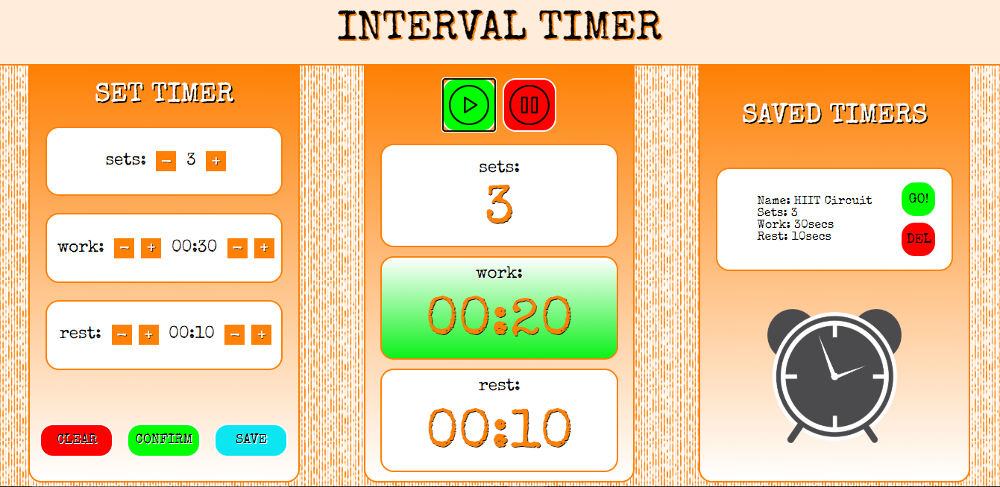

# Interval Timer App



###### May 2020

_I spent quite a bit of time working on this. It felt like my first proper project and I learnt a lot. I think it was the most complex JavaScript coding I'd done so far and it enabled me to feel like I was getting to grips with JS. There were quite a few challenges but with a bit of help to get over them it really helped me to progress and give me new confidence in my ability._

## Main learning points:

- The importance of refactoring. I had a lot of repitition in my code to begin with and it got to the stage where it was overwhelming and I couldn't think straight! It felt so good to refactor it and half the amount of code. Up until this point I'd not really seen the benefits of refactoring in such a striking way as my projects just weren't big enough. This was a great way to learn!

- Started using querySelector's rather than getElementById/ClassName and now I prefer them - I find them simpler and neater.

- Used global variables to cut down on the amount of code in functions. It really helped to tidy up my functions and make them more consise as well as more effective.

- Learnt how to make a pop-up box using position, display, z-index, etc. properties and using JS to get it to appear / disappear.

- Got pretty confident with CSS Flexbox - I feel like I know my way around this now

- Did some maths! Wrote a function which converted numbers into seconds / minutes so it appeared like a digital clock (clock-ify!) and then a function which formatted it visually on the page. I learnt that these were pure functions.

```javascript
function clockify(number) {
  const seconds = number % 60;
  const minutes = (number - seconds) / 60;
  return (
    formatNumbersLessThanTen(minutes) + ":" + formatNumbersLessThanTen(seconds)
  );
}
function formatNumbersLessThanTen(number) {
  if (number <= 9) {
    return "0" + number;
  } else {
    return number;
  }
}
```

## Stretch Goals:

- Save the countdowns in seperate divs / indivually so they can be deleted one at a time

- Save the countdowns to local storage

## Built with:

- HTML
- CSS
- JavaScript

## Getting Started:

Clone the repo as instructed below

## Prerequisites:

No prerequisites

## Installation

1.  Clone the repo

`git clone https://github.com/katiehawcutt/interval-timer-app.git`

2. Run the index.html in a browser

## Usage

1. On the left you can decide how many sets you want to do, how many seconds you want to work for and how many seconds you want to rest for.
2. Once you've set this data press confirm and you'll notice the details appear in the middle container
3. Press the play button to start the workout. You can pause at any time by pressing pause.
4. The save feature is not yet fully functioning as the data is not being saved to local storage. This means that when the page is refreshed the workouts disappear.
